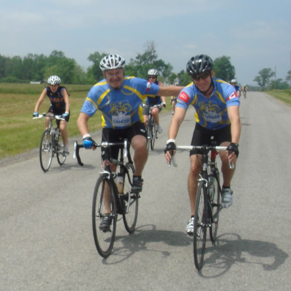
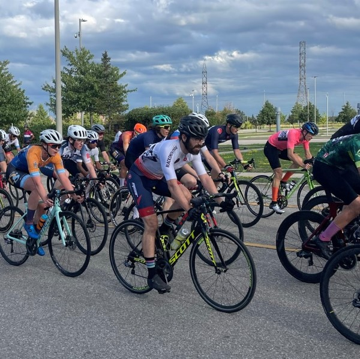
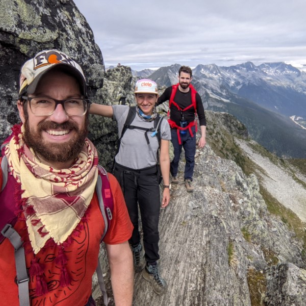
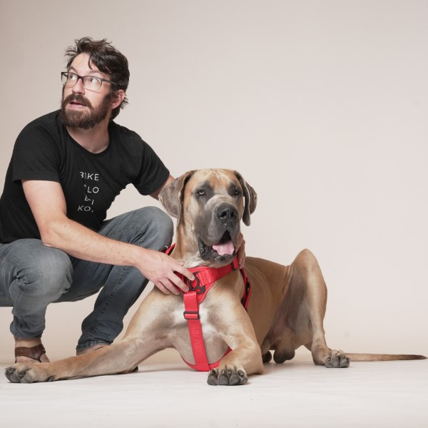

# Summary
- Biochemist-turned-bioinformatician excited about systems biology.  
- Expert in analysis and interpretation of single-cell RNAseq data.
- Passionate about data visualization.
- Very comfortable helping biologists learn meaningful insights from their high-dimensional experimental data.
- Demonstrated ability to learn new analysis techniques, data modalities, and biological contexts.
- Expert in R statistical programming and dashboard building, comfortable building workflows in python and bash.

# Education
<table>
  <tr>
    <td>2016-2023</td>
    <td>Ph.D. candidate, Molecular Genetics, University of Toronto 
        Thesis:	Intercellular signaling networks of a tissue from single-cell transcriptomics. 
        Advisor: <a href="https://baderlab.org/">Dr. Gary Bader</a></td>
  </tr>
  <tr>
    <td>2010-2013</td>
    <td>M.Sc., Biochemistry, University of Western Ontario 
        Thesis:	Exploring the structure and biochemistry of oxidation-mediated inhibition of the peptidyl-prolyl isomerase Pin1. 
        Advisor: <a href="https://www.schulich.uwo.ca/biochem/people/faculty/Litchfield.html">Dr. David Litchfield</a></td>
  </tr>
  <tr>
    <td>2005-2010</td>
    <td>B.M.Sc., Honours Specialization in Cell Biology & Biochemistry, University of Western Ontario</td>
  </tr>
</table>

# Research Projects

## Cell-cell interaction prediction
*2016-2023: PhD work under Dr. Gary Bader, University of Toronto.*  

My most recent PhD work focuses on predicting ligand-receptor interactions from scRNAseq data. First I leveraged our lab's experience making similar predictions from bulk transcriptomes to build [CCInx](https://baderlab.github.io/CCInx/vignettes/CCInxUsage.html). While considering approaches to improve the specificity of our predictions, I identified a flawed assumption underpinning the current state-of-the-art methods.  
**Skills learned/applied:**
- Data cleaning, supervised ML.
- Interactive and static data visualizations.
- Integrating scientific advances from other fields.
- Conceptualization and design of computational experiments, scientific writing.
- Remote coordination with biology collaborators.

### Publications

**Innes BT** & Bader GD. [Transcriptional signatures of cell-cell interactions are dependent on cellular context](https://doi.org/10.1101/2021.09.06.459134). biorxiv, 2021.  
- Systematically demonstrated fundamental flaw in state-of-the-art cell-cell interaction inference methods.
- Hypothesized potential solution from advances in other areas of systems biology.

Ximerakis M, Lipnick SL, **Innes BT**, Simmons SK, Adiconis X, Dionne D, Nguyen L, Mayweather BA, Ozek C, Niziolek Z, Butty VL, Isserlin R, Buchanan SM, Levine SR, Regev A, Bader GD, Levin JZ, Rubin LL. [Single-cell transcriptomic profiling of the aging mouse brain](https://doi.org/10.1038/s41593-019-0491-3). Nature Neuroscience, 2019.  
- Applied my CCInx prediction method to identify ligand-receptor interactions differentially abundant in the aging murine brain.

## Analysis and visualization of scRNAseq data
*2016-2023: PhD work under Dr. Gary Bader, University of Toronto.*  

I began my PhD as high-throughput scRNAseq became available, and no best practices existed. A community of trainees came together to form the [Toronto scAnalysis working group](https://bit.ly/TOscRNAseq) to tackle this challenge.  Learning how to analyze this new data modality while contributing heavily to this community was the highlight of my PhD. I built and maintained a custom workflow and reporting tool based on our assessments of available methods, and expanded on it as needed for our various scientific collaborations.  This tool, [scClustViz](https://baderlab.github.io/scClustViz/) has enabled my collaborators to interpret their own scRNAseq data and [share our published results](http://shiny.baderlab.org/).  
**Skills learned/applied:**
- Workflow construction, package publication in R.
- Interactive and static data visualizations.
- Assessing and applying novel analysis methods.
- Designing computational experiments, scientific writing.
- Learning biology and experimental context from collaborators to fit computational solutions to their needs.

### Publications

Schwab N, Taskina D, Leung E, **Innes BT**, Bader GD, Hazrati LN.  [Neurons and glial cells acquire a senescent signature after repeated mild traumatic brain injury in a sex-dependent manner](https://doi.org/10.3389/fnins.2022.1027116). Frontiers in Neuroscience, 2022.   
- Taught lead author to use my analysis workflow, performed GSEA.

Borrett MJ, **Innes BT**, Tahmasian N, Bader GD, Kaplan DR, Miller FD. [A Shared Transcriptional Identity for Forebrain and Dentate Gyrus Neural Stem Cells from Embryogenesis to Adulthood](https://dx.doi.org/10.1523/ENEURO.0271-21.2021). eNeuro, 2022.  
- Performed factor analysis to place cells and identify gene expression programs associated with differentiation and cell fate axes, performed GSEA.

Coles BLK, Labib M, Poudineh M, **Innes BT**, Belair-Hickey J, Gomis S, Wang Z, Bader GD, Sargent EH, Kelley SO, van der Kooy D. [A microfluidic platform enables comprehensive gene expression profiling of mouse retinal stem cells](https://doi.org/10.1039/D1LC00790D). Lab on a Chip, 2021.  
- Performed scRNAseq analysis workflow, scClustViz used to interpret and share data.

Clarke ZA, Andrews TS, Atif J, Pouyabahar D, **Innes BT**, MacParland SA,  Bader GD.  [Tutorial: guidelines for annotating single-cell transcriptomic maps using automated and manual methods](https://doi.org/10.1038/s41596-021-00534-0). Nature Protocols, 2021.  
- Contributed example visualizations.

Borrett MJ, **Innes BT**, Jeong D, Tahmasian N, Storer MA, Bader GD, Kaplan DR, Miller FD.  [Single-cell profiling shows murine forebrain neural stem cells reacquire a developmental state when activated for adult neurogenesis](https://doi.org/10.1016/j.celrep.2020.108022). Cell Reports, 2020.  
- Performed factor analysis to place cells and identify gene expression programs associated with differentiation and cell fate axes, performed GSEA.

Gage B, Lui JC, **Innes BT**, MacParland SA, McGilvray ID, Bader GD, Keller GM. [Generation of functional liver sinusoidal endothelial cells from human pluripotent stem-cell-derived venous angioblasts](https://doi.org/10.1016/j.stem.2020.06.007). *Cell Stem Cell*, 2020.  
- Aided in implementation of scRNAseq analysis workflow, scClustViz used to interpret and share data.

**Innes BT** & Bader GD. [scClustViz – Single-cell RNAseq cluster assessment and visualization** [version 2; peer review: 2 approved]](http://doi.org/10.12688/f1000research.16198.2). F1000Research, 2019.  
- Built RShiny interactive scRNAseq data reporting solution.
- Proposed a novel metric for assessing cluster results.
- Fixed a common error in differential expression magnitude reporting.

MacParland SA, Liu JC, Ma XZ, **Innes BT**, Bartczak AM, Gage BK, Manuel J, Khuu N, Echeverri J, Linares I, Gupta R, Cheng ML, Liu LY, Camat D, Chung SW, Seliga RK, Shao Z, Lee E, Ogawa S, Ogawa M, Wilson MD, Fish JE, Selzner M, Ghanekar A, Grant D, Greig P, Sapisochin G, Selzner N, Winegarden N, Adeyi O, Keller G, Bader GD, McGilvray ID. [Single cell RNA sequencing of human liver reveals distinct intrahepatic macrophage populations](https://doi.org/10.1038/s41467-018-06318-7). Nature Communications, 2018.  
- Performed scRNAseq analysis of the first whole human organ single-cell atlas.
- Learned a lot about contaminating RNA and patient-specific signal.

Yuzwa SA, Borrett MJ, **Innes BT**, Voronova A, Ketela T, Kaplan DR, Bader GD, Miller FD. [Developmental Emergence of Adult Neural Stem Cells as Revealed by Single-Cell Transcriptional Profiling](https://doi.org/10.1016/j.celrep.2017.12.017). Cell Reports, 2017.  
- Built scRNAseq analysis workflow in bash & R prior to field consensus on best practices.
- Performed ad hoc assessment of available methods.
- Developed novel data visualizations to aid interpretation and communicate findings.
- Learned cell biology of neurodevelopment.

## Structure & function of Pin1
*2009-2013: Honours thesis and MSc work under Dr. David Litchfield, University of Western Ontario.*  

Studied the structural effects of oxidative stress on Pin1 isomerase activity, as well as its domain-specific binding mechanisms. Systematically assayed structural requirements for novel small-molecule Pin1 inhibitors.  
**Relevant skills learned:**
- Enzyme structure/function relationship in the context of substrate binding kinetics.
- Experimental design, interpretation of literature, scientific writing.

### Publications
**Innes BT**, Sowole MA, Gyenis L, Dubinsky M, Konermann L, Brandl CJ, Litchfield DW, Shilton BH. [Peroxide-Mediated Oxidation and Inhibition of the Peptidyl-Prolyl Isomerase Pin1](https://doi.org/10.1016/j.bbadis.2014.12.025). Biochimica et Biophysica Acta (BBA) - Molecular Basis of Disease, 2015.  
- Used x-ray crystallography to identify atomic structures of Pin1 undergoing pathologically relevant reversible and irreversible oxidation.

Sowole MA, **Innes BT**, Amunugama M, Brandl CJ, Shilton BH, Litchfield DW, Konermann L. [Noncovalent binding of a cyclic peptide inhibitor to the peptidyl-prolyl isomerase Pin1 explored by hydrogen exchange mass spectrometry](https://doi.org/10.1139/cjc-2014-0230). Canadian Journal of Chemistry, 2014.  
- Systematic assessment of peptide inhibitors of Pin1 by phage display led to the development of this candidate molecule.

**Innes BT**, Bailey ML, Brandl CJ, Shilton BH, Litchfield DW. [Non-catalytic participation of the Pin1 peptidyl-prolyl isomerase domain in target binding](https://doi.org/10.3389/fphys.2013.00018). Frontiers in Physiology, 2013.  
- Assayed kinetics and specificity of substrate binding in the context of pathologically relevant Pin1 mutants.

## Other projects
<table>
  <tr>
    <td>2015-2016</td>
    <td><em>Studentship under Dr. Fritz Roth, University of Toronto.</em> 
        Studied adaptation under selection in the yeast 2 hybrid experimental system by whole-genome sequencing.</td>
  </tr>
  <tr>
    <td>2013-2015</td>
    <td><em>Ph.D. student under Dr. Igor Jurisica, Medical Biophysics, University of Toronto. (Withdrawn)</em> 
        Investigated the histotype-specific role of Cdx2 in ovarian cancer progression using publicly available microarray expression data, applying various statistical and network analysis techniques.</td>
  </tr>
</table>

# Teaching Experience
<table>
  <tr>
    <td>2020-2021</td>
    <td>TA: Foundational Genetic Approaches II: Programming for Biologists 
        <em>Taught programming exercise tutorials and marked assignments.</em></td>
  </tr>
  <tr>
    <td>2019-2020</td>
    <td>TA: Foundational Genetic Approaches I: Genomics 
        <em>Developed and ran tutorials and assignments on fundamental applications in genomics, as well as ran weekly journal club.</em></td>
  </tr>
  <tr>
    <td>2015-2017</td><td>TA: Quantitative Biology and Statistical Methods 
        <em>Responsible for the content and presentation of weekly tutorials applying course material to computational assignments using R.</em></td>
  </tr>
</table>

# Academic Awards and Honours
<table>
  <tr>
    <td>2020</td><td>PRiME Fellowship in Next-Generation Precision Medicine at the University of Toronto</td>
  </tr>
  <tr>
    <td>2018</td><td>Till & McCulloch Meeting travel award sponsored by Medicine by Design</td>
  </tr>
  <tr>
    <td>2017</td><td>David Stephen Cant Graduate Scholarship in Stem Cell Research</td>
  </tr>
  <tr>
    <td>2010-2012</td><td>Western Graduate Research Scholarship</td>
  </tr>
  <tr>
    <td>2010</td><td>Gold Medal – Honours in Cell Biology & Biochemistry</td>
  </tr>
  <tr>
    <td>2010</td><td>Course Award – Cell Biology & Biochemistry Honours Thesis</td>
  </tr>
</table>

# Beyond academia, who am I?

I co-captain Team Innes - we ride every year in the Ride to Conquer Cancer in memory of my dad. To date, we have raised over $2M for the Princess Margaret Cancer Centre.  

  

	

  		
  		
My dad and I riding in the inaugural Ride to Conquer Cancer

	

  

  
  

	

  		
  		
Bike racing is teamwork and trust in strangers' skill

	

  

I dabble in both mountain biking and road racing.  I enjoy spending time in the mountains with my family when possible - more recently my wife and I have taken up mountaineering.  Finally, my favourite daily hobby is taking our Great Dane, Moose, to the dog park.  

  

	

  		
  		
My wife, my brother, and I on the ridgewalk approach to Mount Afton

	

  

  
  

	

  		
  		
Moose's brief career as a giant-sized model

	

  

